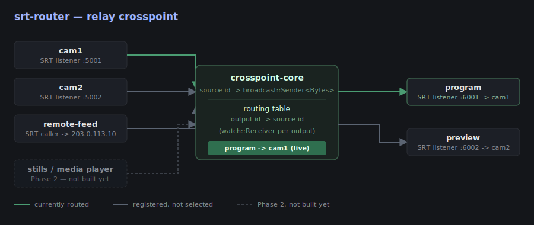
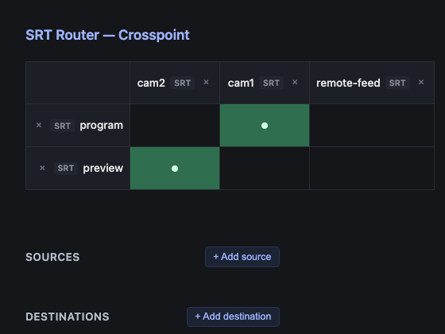
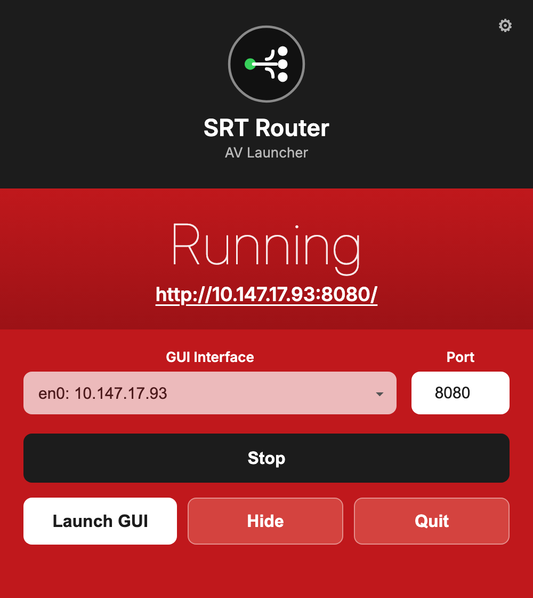

# srt-router

> **AI-assisted project.** This codebase was created with [Claude](https://claude.com/claude-code)
> (Anthropic), directed and reviewed by a human author. The relay/crosspoint
> engine and web UI have been exercised locally — including integration
> tests that relay real SRT and NDI protocol traffic end-to-end and a live
> crosspoint switch via the web UI, see [Status](#status) — but **not yet
> run against real-world third-party SRT/NDI encoders/decoders or over an
> actual (non-loopback) network path**. Review before relying on it for
> anything live.

A crosspoint-based [SRT](https://www.srtalliance.org/) router: any number of
SRT inputs, any number of SRT outputs, and a router-style crosspoint (each
output picks exactly one source, switchable live) connecting them — the same
mental model as a broadcast video router, applied to SRT streams instead of
SDI/HDMI.





*The web UI above is a real screenshot of the router running locally against
[config/example.toml](config/example.toml), not a mockup — captured while
verifying the routing/persistence/websocket/add-remove behavior described in
[Status](#status) below.*

## What it does

By default, routing is a **pure relay**: the crosspoint moves opaque payload
chunks from an input SRT connection to an output SRT connection with no
decode/re-encode, so switching is effectively free (no transcode cost, no
added latency beyond SRT's own buffering). That's the right behavior for the
common case — plain stream switching — but it's not the *only* thing a
source can be. The engine's source abstraction is intentionally payload-only
(see [docs/architecture.md](docs/architecture.md)), so special-purpose
sources that actually generate a stream — a still image, a local media
player, a scaler tap on another source — can register into the same
crosspoint as a "source" without the engine caring that they're not relayed
SRT. **Not built yet** — Phase 1 is relay-only; see
[docs/roadmap.md](docs/roadmap.md).

Control is a local web UI backed by a small REST API: a crosspoint grid
(click a cell to route that output from that source), plus **Add
source**/**Add destination** menus and a remove control on every row/column
for adding or tearing down SRT inputs/outputs at runtime — not just what was
in the TOML config at startup. No auth/TLS — this is meant to run on a
trusted operations network, the same trust model as a hardware router's
control port.

**Transports beyond SRT:** `crates/ndi-io` is a real, tested NDI transport
(see [Status](#status)), usable behind an opt-in `ndi` Cargo feature
(`cargo run --features ndi`) from both the TOML config and the runtime
add-source/add-destination REST API. The web UI still lists NDI as a
disabled, config-only option — enabling it live from the UI is the remaining
step. `crates/omt-io` is the same idea for
[OMT](https://openmediatransport.org/) — a genuinely open, MIT-licensed
alternative to NDI — implemented and tested via hand-written FFI against the
real SDK (requires `OMT_LIB_DIR`, no bindgen). It is not yet wired into the
router binary's config/API/UI the way NDI is; that's the next step (see
[docs/roadmap.md](docs/roadmap.md)).

## Status

**Phase 1 (current): relay-only crosspoint + web UI, dynamic add/remove.**
Working:

- SRT input/output as either `listener` (this router waits for a
  connection) or `caller` (this router dials out), each reconnecting on its
  own if the connection drops.
- The crosspoint engine (`crates/core`) — output-follows-route-change
  behavior is unit tested.
- A local web UI (`crates/web`) — grid of outputs x sources, click to route,
  updated live over a websocket (`GET /ws`) with a REST poll (`GET
  /api/state`) as first paint / fallback.
- **Runtime add/remove**: `POST`/`DELETE /api/manage/sources` and
  `/api/manage/outputs` (`crates/router/src/management.rs`) spawn or tear
  down an SRT input/output on the fly — the same code path the static TOML
  config uses at startup, so a config-declared source is exactly as
  removable as one added later. Backed by
  [`tokio_util::sync::CancellationToken`](https://docs.rs/tokio-util) per
  task (added to `srt-io`) so removal actually stops the task and frees the
  socket, not just forgets about it. The web UI exposes this as **Add
  source**/**Add destination** forms plus a remove control per row/column.
- Routing changes optionally persist to disk (`[state]` in the config) and
  reload on restart, overriding each output's `default_source`.
- `crates/ndi-io`: a real NDI transport using
  [grafton-ndi](https://github.com/GrantSparks/grafton-ndi) (Apache-2.0)
  against the actual NDI SDK, with its own integration test driving a real
  NDI sender and receiver against it, consistently passing. Usable from
  `srtrouter`'s TOML config **and** the runtime add/remove REST API behind an
  opt-in `ndi` Cargo feature (`cargo run --features ndi`); the web UI still
  lists NDI as a disabled, config-only option, see [What it does](#what-it-does).
- `crates/omt-io`: a real, tested [OMT](https://openmediatransport.org/)
  transport via hand-written FFI against the OMT SDK (`OMT_LIB_DIR`, no
  bindgen), with its own relay integration test — implemented as a transport
  crate but not yet wired into the router's config/API/UI (that's next).
- CI (GitHub Actions) runs `fmt --check`, `clippy -D warnings`, and the full
  test suite on every push/PR — SRT-only (`ndi-io`/`omt-io` need real
  SDKs CI can't install, so they're real workspace members but excluded
  from `default-members`, see [docs/architecture.md](docs/architecture.md)).
- Verified locally, not just compiled: `cargo test` passes, including
  integration tests (`crates/srt-io/tests/relay.rs`,
  `crates/ndi-io/tests/relay.rs`) that relay real protocol traffic
  end-to-end through the crosspoint — one SRT test also exercises a **live
  re-route mid-stream over an already-established connection**. Separately
  confirmed by hand: running the binary against `config/example.toml` binds
  real UDP/SRT listener sockets (via `lsof`), adding a source through the
  web UI binds a new one live and removing it frees the port (also via
  `lsof`), the REST API and a real browser click both drive live crosspoint
  changes, the websocket push updates the grid with no client-side polling,
  and a persisted route survives a real process restart.

**Not yet done:** no test against a real third-party SRT/NDI encoder or
decoder, or over a real (non-loopback) network path — only local testing so
far, still the main open gap. Also missing: NDI enabled live from the web UI
(it works today from the TOML config and the REST API), OMT wired into the
router (the transport crate is implemented and tested, just not yet in the
router's config/API/UI), special-purpose sources (stills/media player/scaler
— the add-source menu shows them as disabled options), auth on the web
UI/API, external control API/Companion integration. See
[docs/roadmap.md](docs/roadmap.md) for the full phased plan.

## Quick start

```sh
cargo run --bin srtrouter -- --config config/example.toml
```

Then open `http://localhost:8080` for the crosspoint grid. Edit
[config/example.toml](config/example.toml) (or point `--config` at your own
file) to declare your actual inputs/outputs — see the comments in that file
for the config format.

## Desktop app

Prefer not to touch the terminal? A small menu-bar app lets you pick the network
interface + port, Start/Stop the server, and open the web UI. The `srtrouter`
server is bundled inside, so it's a single download — nothing to install or wire
up. Grab the `.dmg` from
[Releases](https://github.com/allansargeant/srt-router/releases), or see
[launcher/](launcher/) to build it.

<p align="center"></p>

## Architecture

See [docs/architecture.md](docs/architecture.md) for the source/output/
crosspoint model and how the relay-vs-generated source distinction is meant
to extend later without changing the core engine.

## Roadmap / TODO

Full phased plan in [docs/roadmap.md](docs/roadmap.md). Main open items:

- [ ] **Real-world testing** — against a third-party SRT/NDI encoder/decoder and over a real (non-loopback) network path; the main open gap.
- [ ] **NDI live in the web UI** — already usable from the TOML config and the runtime REST API (behind the `ndi` feature); the web UI still lists it as a disabled, config-only option.
- [ ] **OMT wired into the router** — `crates/omt-io` is implemented and tested; wire it into the router's config/API/UI the way NDI is.
- [ ] **Special-purpose sources** — stills, local media player, scaler tap (shown as disabled options in the add-source menu today).
- [ ] **Auth/TLS** on the web UI/API.
- [ ] **External control API / Bitfocus Companion** integration.
